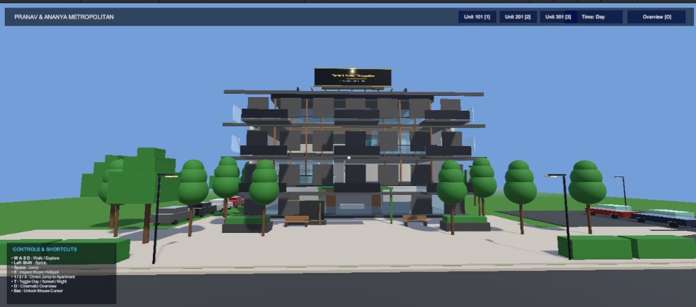
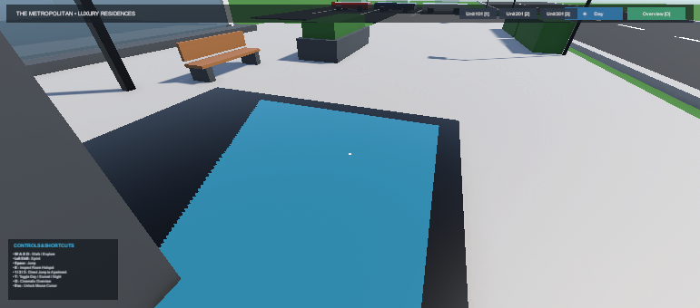
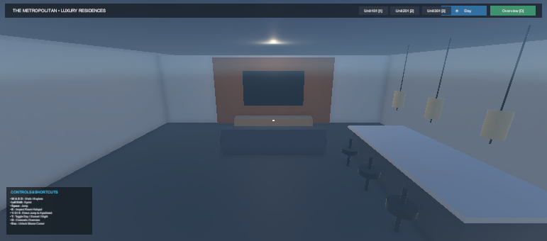
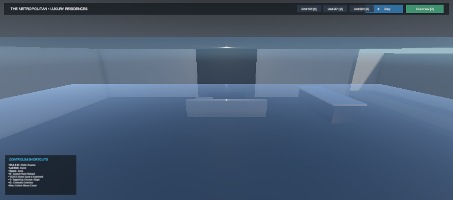
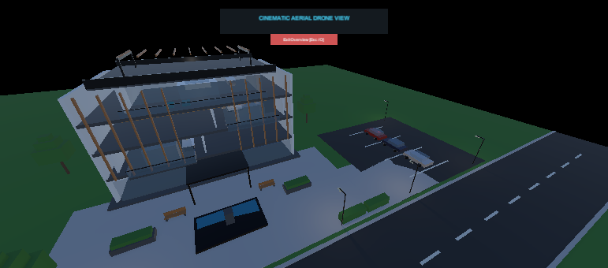

# 🏡 Luxury Villa Walkthrough – AR

An immersive 3D architectural visualization and interactive villa walkthrough built with **Unity 6** and the **Universal Render Pipeline (URP)**, featuring multi-mode camera exploration, real-time lighting transitions, and procedural audio feedback.


---

<p align="center">
  
</p>

---

## 📖 About the Project

**Luxury Villa Walkthrough – AR** is a modern, interactive 3D architectural exploration environment developed in Unity 6. Designed for high-end architectural visualization and digital real estate tours, this application allows users to seamlessly navigate through a luxury villa and apartment suite, inspect interior living spaces, evaluate architectural specifications, and dynamically switch atmospheric lighting conditions.

The project demonstrates production-ready Unity C# architecture, combining custom first-person movement, mathematical orbit camera transitions, procedural emission pulse highlighting, a real-time day/night lighting engine, and zero-asset procedural audio synthesis.

---

## 📸 Project Showcase

<table>
<tr>
<td width="50%">
  
  <p align="center"><b>🏡 Villa Exterior & Entrance</b><br><i>Architectural facade featuring Scandinavian design aesthetic, landscaping, and outdoor pathways.</i></p>
</td>
<td width="50%">
  
  <p align="center"><b>🔍 Overview & Suite Inspection</b><br><i>Cinematic overview mode with active emission pulse highlighting and metadata card display.</i></p>
</td>
</tr>
<tr>
<td width="50%">
  
  <p align="center"><b>🛋️ Open Living & Kitchen Environment</b><br><i>Interior view showing hardwood oak flooring, custom cabinetry, dining area, and ambient light distribution.</i></p>
</td>
<td width="50%">
  
  <p align="center"><b>🌙 Real-Time Sunset & Night Lighting</b><br><i>Dynamic lighting transition showcasing warm interior emissives, exterior spot lighting, and night skybox aesthetics.</i></p>
</td>
</tr>
</table>

---

## ✨ Key Features

- 🏡 **3D Architectural Environment**: Detailed luxury villa design featuring open-plan living rooms, hardwood oak floors, marble surfaces, floor-to-ceiling glass windows, and exterior landscaping.
- 🕹️ **Multi-Mode Camera Navigation**:
  - **First-Person Free Roam**: FPS-style movement with smooth pitch/yaw damping and procedural head-bob animation.
  - **Orbit Inspection**: Smooth camera Lerp/Slerp into 360° mouse-drag orbit with scroll-wheel zoom distance clamping.
  - **Cinematic Overview**: Slow rotating camera around the villa for comprehensive architectural viewing.
- ☀️ **Real-Time Day/Night & Lighting Engine**:
  - 3 customizable lighting states: **Day**, **Golden Hour Sunset**, and **Night**.
  - Smooth rotational and color transitions for directional sun light and ambient skylight.
  - Automated toggling of night spot lights and window emissive materials.
- 🔍 **Interactive Target Inspection**:
  - FPS raycasting with proximity prompt badges.
  - Dynamic emission pulse highlighting on target objects during hover.
  - Interactive UI Cards displaying unit ID, title, floor type, square footage, rent/price, and amenity highlights.
- 🔊 **Procedurally Synthesized Audio Engine**:
  - Runtime C# audio generator (`SoundManager.cs`) synthesizing sine-wave waveforms for footsteps (walk & sprint pitch shifts), jumping, landing, camera swooshes, UI hover/clicks, and day/night transitions without external audio assets.
- 🖥️ **Dual URP Pipeline Configuration**: Built-in support and graphics profiles for high-end PC rendering as well as optimized mobile URP targets.

---

## 🎮 Controls & Interaction

| Action | Input Key / Mouse | Mode |
|---|---|---|
| **Move (Forward / Back / Left / Right)** | `W` `A` `S` `D` | Free-Roam |
| **Look Around** | `Mouse Movement` | Free-Roam |
| **Sprint** | `Left Shift` | Free-Roam |
| **Jump** | `Space` | Free-Roam |
| **Inspect Targeted Area** | `Left Click` or `E` | Free-Roam (On Prompt) |
| **Rotate Camera View** | `Mouse Left/Right Drag` | Orbit Inspection Mode |
| **Zoom Camera In / Out** | `Mouse Scroll Wheel` | Orbit Inspection Mode |
| **Cycle Day / Night Lighting** | `T` or UI Button | All Modes |
| **Toggle Overview Mode** | `O` or UI Button | All Modes |
| **Exit Inspection / Overview** | `Esc` or UI Button | Inspection / Overview |

---

## 🛠️ Technologies Used

| Technology | Role / Implementation Details |
|---|---|
| **Unity 6 (6000.5.5f1)** | Primary game engine, 3D environment assembly, and rendering framework |
| **Universal Render Pipeline (URP 17.5.0)** | High-fidelity shader execution, custom volume profiles, and multi-platform lighting |
| **C# (.NET)** | Object-oriented gameplay logic, state machines, and mathematical camera controls |
| **Unity Input System (1.19.0)** | Modern input handling with legacy fallback support via custom `InputBridge` |
| **Unity NavMesh Navigation (2.0.14)** | Spatial navigation and collision boundary management |
| **Git & GitHub** | Source control management, repository documentation, and asset tracking |

---

## ⚙️ Technical Implementation

### 1. State-Driven Game Architecture (`GameManager.cs`)
The application utilizes an enum-based central state machine (`GameState.MainMenu`, `FreeRoam`, `InspectApartment`, `OverviewMode`). It coordinates UI panel switching, cursor locking (`CursorLockMode.Locked` vs `None`), and player spawn points.

### 2. Advanced Camera Controllers (`CameraController.cs` & `PlayerController.cs`)
- **First-Person Dynamics**: Implemented using Unity's `CharacterController` with gravity calculation, sprint acceleration, footstep timing sync, and sinusoidal head-bob offset math.
- **Mathematical Orbit System**: Smoothly lerps between camera positions using `Quaternion.Slerp` and `Vector3.Lerp`. Computes 360° spherical orbit positions using:
  $$	ext{Position} = 	ext{Target} + 	ext{Rotation} 	imes 	ext{Vector3.back} 	imes 	ext{Distance}$$

### 3. Dynamic Atmospheric Engine (`DayNightCycle.cs`)
Handles real-time interpolation of directional lighting angles, RGB color values, and ambient light intensity. Smoothly transitions sun angles (Day: 50°, Sunset: 15°, Night: -35°) while synchronizing window emissive shaders and exterior light groups.

### 4. Raycast Interaction & Visual Feedback (`InteractionRaycaster.cs` & `InspectableApartment.cs`)
A center-screen raycaster identifies inspectable GameObjects. Target materials utilize `MaterialPropertyBlock` to update `_EmissionColor` dynamically with a sinusoidal pulse timer without creating runtime material instances.

### 5. Runtime Procedural Audio Synthesis (`SoundManager.cs`)
Instead of relying on heavy WAV/MP3 files, the audio engine programmatically generates raw PCM audio data buffers at runtime using C# sine wave mathematical synthesis, feeding directly into `AudioClip.Create`.

---

## 📂 Project Structure

```
Luxury_villa_walkthrough_ar/
│
├── Assets/
│   ├── Materials/                  # PBR materials (Oak, Marble, Glass, Water, Emissive)
│   ├── Scenes/
│   │   └── SampleScene.unity       # Primary 3D Villa Walkthrough Scene
│   ├── Screenshots/                # Raw project visual captures
│   ├── Scripts/
│   │   ├── Audio/
│   │   │   └── SoundManager.cs     # Procedural audio generator & manager
│   │   ├── Core/
│   │   │   ├── GameManager.cs      # Master state machine & tour controller
│   │   │   └── InputBridge.cs      # Input System / Legacy Input abstraction
│   │   ├── Environment/
│   │   │   └── DayNightCycle.cs   # Lighting presets & atmospheric transitions
│   │   ├── Interaction/
│   │   │   ├── InspectableApartment.cs # Target data & emission pulse highlighting
│   │   │   └── InteractionRaycaster.cs # First-person raycasting & target detection
│   │   ├── Player/
│   │   │   ├── CameraController.cs # Free-roam, Orbit, and Overview camera controller
│   │   │   └── PlayerController.cs # CharacterController physics & head-bob logic
│   │   └── UI/
│   │       └── UIManager.cs        # HUD, apartment cards, and menu controllers
│   └── Settings/                   # Universal Render Pipeline (URP) PC & Mobile profiles
│
├── Packages/
│   └── manifest.json               # Package dependencies (URP 17.5.0, InputSystem 1.19.0)
├── ProjectSettings/
│   └── ProjectVersion.txt          # Unity version definition (6000.5.5f1)
├── screenshots/                    # High-resolution documentation showcase gallery
├── .gitignore                      # Unity-optimized version control rules
├── apt_tour.slnx                   # Solution configuration file
└── README.md                       # Project documentation
```

---

## 🚀 How to Run

1. **Clone the Repository**:
   ```bash
   git clone https://github.com/pranavmoff/Luxury_villa_walkthrough_ar.git
   ```
2. **Open Unity Hub**:
   - Click **Add** -> **Add project from disk**.
   - Select the cloned `Luxury_villa_walkthrough_ar` folder.
3. **Select Unity Version**:
   - Open using **Unity 6 (6000.5.5f1)** or a compatible Unity 6 release.
4. **Load the Main Scene**:
   - In the Project window, navigate to `Assets/Scenes/SampleScene.unity`.
   - Double-click to open the scene.
5. **Run the Project**:
   - Click the **Play** button at the top of the Unity Editor to start the interactive walkthrough.

---

## 🎨 Environment & Design

The environment was assembled with a focus on luxury residential architecture:
- **Materials & Aesthetics**: Clean Scandinavian palette combining natural light wood slats, dark teal fabric accents, polished white marble flooring, warm glowing fireplace emissives, and glass balustrades.
- **Lighting Atmosphere**: Balanced directional and ambient lighting tuned specifically for Unity's URP pipeline, giving crisp shadows during full daylight, warm golden glows during sunset, and dramatic accent lighting at night.

---

## 🧑‍💻 Development Highlights

- **Zero-Dependency Audio System**: Built a complete procedural sound generator using C# mathematical wave synthesis, eliminating external sound asset size overhead.
- **Modular Camera Mathematics**: Standardized transitions between first-person movement, target orbit inspection, and continuous world overview using smooth quaternions and spherical coordinates.
- **Clean Shader Property Manipulation**: Optimized performance by manipulating `MaterialPropertyBlock` emission properties rather than cloning material instances in memory during object hover states.

---

## 🔮 Future Improvements

- 📱 **Mobile AR Tracking Integration**: Expanding current mobile URP pipeline compatibility into full AR Foundation tracking (ARCore / ARKit) for table-top architectural placement.
- 🎨 **Material & Furniture Customization**: Allowing interactive swapping of floor materials, wall paints, and furniture colors in real time.
- 🚪 **Animated Building Elements**: Adding interactive door opening, window sliding, and appliance toggle animations.
- 🌐 **WebGL Build Optimization**: Fine-tuning memory footprint for seamless browser-based architectural demos.

---

## 🎓 Learning Outcomes

- Mastery of **Unity 6** project structure and **URP** render pipeline setup.
- Implementation of C# design patterns including Singletons, State Machines, and Input Abstraction layers.
- Applied mathematics for 3D camera orbital mechanics and smooth interpolation algorithms.
- Custom C# runtime audio buffer generation.
- Professional Git repository organization and technical documentation standards.

---

## 📌 Project Information

| Property | Details |
|---|---|
| **Project Title** | Luxury Villa Walkthrough – AR |
| **Engine** | Unity 6 (6000.5.5f1) |
| **Render Pipeline** | Universal Render Pipeline (URP 17.5.0) |
| **Language** | C# (.NET) |
| **Input System** | Unity New Input System (1.19.0) |
| **Type** | 3D Interactive Architectural Walkthrough |
| **Repository** | [pranavmoff/Luxury_villa_walkthrough_ar](https://github.com/pranavmoff/Luxury_villa_walkthrough_ar) |

---

## 🔗 Repository

GitHub Repository Link:  
[https://github.com/pranavmoff/Luxury_villa_walkthrough_ar](https://github.com/pranavmoff/Luxury_villa_walkthrough_ar)

---

## ✨ Final Showcase

### 1. Villa Showcase
<p align="center">
  
</p>

### 2. Car Parking
> **Note to Developer:** Please capture the actual parking area from the running project. Show the cars, parking area, villa/environment, and landscaping using a clean, attractive game-camera view. Save it as `screenshots/02-car-parking.png` to replace the broken image link below.
<p align="center">
  
</p>

### 3. Lawn / Landscaping
> **Note to Developer:** Please capture the actual lawn/garden area from the running project. Show the grass, trees, bushes, pathways, and surrounding villa/environment from the most visually appealing angle. Save it as `screenshots/03-lawn-landscape.png` to replace the broken image link below.
<p align="center">
  
</p>

<p align="center">
  <b>An interactive Unity environment combining 3D architectural visualization, dynamic atmospheric design, and interactive exploration.</b>
</p>
